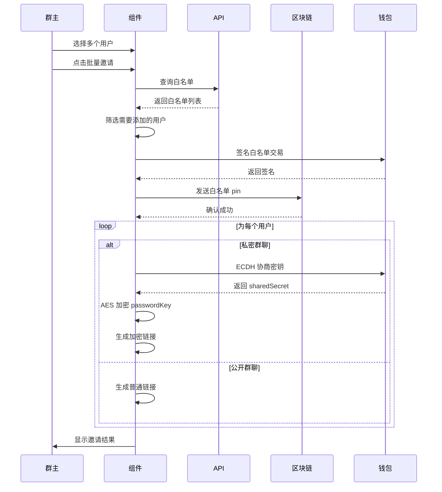

# 批量邀请功能实现

## 更新日期

2025 年 11 月 23 日

## 功能概述

实现了批量邀请用户到群聊的功能，支持公开群聊和私密群聊的批量邀请，包括自动添加白名单、ECDH 加密、生成邀请链接等完整流程。

## 核心功能

### 1. 批量邀请工具函数

**文件：** `src/utils/talk.ts`

**新增函数：** `batchInviteUsersToGroup()`

**功能流程：**

```
1. 查询群组白名单列表
   ↓
2. 筛选出不在白名单中的用户
   ↓
3. 发送 pin 添加用户到白名单
   ↓
4. 为每个用户生成邀请链接
   ├─ 公开群聊：生成普通链接
   └─ 私密群聊：使用 ECDH + AES 加密 passwordKey
   ↓
5. 返回批量邀请结果
```

**参数说明：**

```typescript
{
  groupId: string              // 群组ID
  userList: Array<{           // 用户列表
    metaId: string
    chatPublicKey: string      // 用于 ECDH 加密
    userName?: string
  }>
  passwordKey?: string         // 私密群聊的密码密钥
}
```

**返回值：**

```typescript
{
  status: 'success' | 'failed' | 'partial'  // 总体状态
  results: Array<{                          // 每个用户的结果
    metaId: string
    userName?: string
    status: 'success' | 'failed'
    inviteUrl?: string                      // 邀请链接
    error?: string                           // 错误信息
  }>
}
```

### 2. 白名单管理

**API 接口：** `getGroupJoinControlList()`

**文件：** `src/api/talk.ts`

**接口地址：** `/group-chat/group-join-control-list?groupId={groupId}`

**响应格式：**

```json
{
  "code": 0,
  "data": {
    "groupId": "xxx",
    "joinBlockMetaIds": null,
    "joinWhitelistMetaIds": ["metaid1", "metaid2", ...]
  },
  "message": "success",
  "processingTime": 0
}
```

**白名单更新逻辑：**

```typescript
// 1. 获取现有白名单
const existingWhitelist = controlListRes.data.joinWhitelistMetaIds || []

// 2. 筛选需要添加的用户
const usersToAdd = userList.filter(user => !existingWhitelist.includes(user.metaId))

// 3. 合并白名单
const newWhitelist = [...existingWhitelist, ...usersToAdd.map(u => u.metaId)]

// 4. 发送 pin 更新白名单
const dataCarrier = {
  groupId,
  users: newWhitelist,
}

const node = {
  protocol: NodeName.SimpleGroupWhitelist,
  body: dataCarrier,
}

await buildTx.setChannelWhiteList({
  protocol,
  body,
  isBroadcast: true,
})
```

### 3. ECDH 加密实现

**私密群聊邀请加密流程：**

```typescript
// 1. 使用钱包 ECDH 协商密钥
const { sharedSecret } = await window.metaidwallet.common.ecdh({
  externalPubKey: user.chatPublicKey,
})

// 2. 使用共享密钥 AES 加密 passwordKey
const CryptoJS = await import('crypto-js')
const encryptedPasscode = CryptoJS.AES.encrypt(passwordKey, sharedSecret).toString()

// 3. URL 编码
const encodedPasscode = encodeURIComponent(encryptedPasscode)

// 4. 生成邀请链接
const inviteUrl = `${window.location.origin}/channels/private/${groupId}?passcode=${encodedPasscode}`
```

### 4. UI 实现

**文件：** `src/views/talk/components/ChannelMemberListDrawer.vue`

**新增 UI 元素：**

1. **用户选择复选框**

   - 每个用户左侧添加复选框
   - 支持多选
   - 未开通私聊的用户复选框禁用

2. **已选用户列表**

   ```vue
   <div class="selected-users">
     <span>已选用户: {{ selectedUsers.length }}</span>
     <ElButton @click="clearSelectedUsers">清空全部</ElButton>
     <el-tag v-for="user in selectedUsers" closable>
       {{ user.userName }}
     </el-tag>
   </div>
   ```

3. **批量邀请按钮**
   ```vue
   <ElButton type="primary" :loading="batchInviting" @click="handleBatchInvite">
     批量邀请 ({{ selectedUsers.length }})
   </ElButton>
   ```

**新增状态：**

```typescript
const selectedUsers = ref<SearchUserItem[]>([]) // 选中的用户列表
const batchInviting = ref(false) // 批量邀请中
```

**新增方法：**

```typescript
// 检查用户是否被选中
isUserSelected(metaId: string): boolean

// 切换用户选中状态
toggleUserSelection(user, checked)

// 移除已选用户
removeSelectedUser(metaId: string)

// 清空所有选中
clearSelectedUsers()

// 执行批量邀请
handleBatchInvite()
```

## 使用流程

### 群主操作流程

1. **打开邀请弹窗**

   - 点击群成员列表中的"邀请成员"按钮

2. **搜索用户**

   - 输入关键字搜索用户
   - 系统自动获取用户的 chatPublicKey

3. **选择用户**

   - 勾选要邀请的用户（支持多选）
   - 已选用户显示在顶部标签列表
   - 未开通私聊的用户无法选择（复选框禁用）

4. **批量邀请**

   - 点击"批量邀请"按钮
   - 系统自动：
     1. 添加用户到白名单
     2. 生成加密邀请链接
     3. 显示邀请结果

5. **查看结果**
   - 成功：显示成功邀请的用户数
   - 部分成功：显示成功和失败的数量
   - 失败：显示错误信息

### 技术流程



## 安全性说明

### 加密机制

1. **ECDH 密钥协商**

   - 使用椭圆曲线 Diffie-Hellman 算法
   - 每个用户使用不同的共享密钥
   - 第三方无法从交换信息中推导密钥

2. **AES 对称加密**

   - 使用 ECDH 协商的共享密钥作为 AES 密钥
   - 加密 passwordKey 后传输
   - 只有拥有对应私钥的用户才能解密

3. **URL 编码**
   - 加密后的密文进行 URL 编码
   - 避免特殊字符导致的 URL 解析问题

### 权限控制

1. **白名单机制**

   - 用户必须在白名单中才能加入群聊
   - 批量邀请自动添加到白名单
   - 使用区块链 pin 确保不可篡改

2. **chatPublicKey 验证**
   - 私密群聊必须验证用户是否开通私聊
   - 未开通私聊的用户无法被邀请
   - 防止无效邀请

## 日志输出

### 控制台日志

批量邀请过程中会输出详细的日志，方便调试：

```
🚀 开始批量邀请: { groupId, userCount, hasPasswordKey }
📋 查询群组白名单列表...
✅ 当前白名单用户数: 5
➕ 需要添加到白名单的用户数: 3
📤 添加用户到白名单...
✅ 白名单更新成功, txid: xxx
🔗 生成邀请链接...
🔐 为用户 xxx... 生成加密邀请链接
🔑 ECDH 协商密钥成功: xxx...
🔒 AES 加密成功, passcode 长度: 128
✅ 用户 xxx... 邀请链接生成成功
📊 批量邀请完成: { total: 3, success: 3, failed: 0 }
```

### 用户提示

- **成功**：`成功邀请 3 位用户`
- **部分成功**：`成功邀请 2 位用户，1 位失败`
- **失败**：`邀请失败：3 位用户`

## TODO 项

### 1. 发送邀请链接

**当前状态：** TODO 标记

**位置：** `src/utils/talk.ts` 第 2187 行

```typescript
// TODO: 发送邀请链接给用户
// await sendInviteMessage(user.metaId, inviteUrl)
```

**需要实现：**

- 通过私聊或系统消息发送邀请链接
- 或者通过其他通知机制告知用户

### 2. 邀请结果展示优化

**建议：**

- 添加邀请结果弹窗，显示每个用户的详细状态
- 支持复制单个用户的邀请链接
- 支持重新邀请失败的用户

### 3. 邀请历史记录

**建议：**

- 记录邀请历史
- 支持查看已发送的邀请
- 支持撤销邀请

## 国际化

**新增翻译：**

```json
// zh.json
{
  "Talk": {
    "Channel": {
      "selected_users": "已选用户",
      "clear_all": "清空全部",
      "batch_invite": "批量邀请"
    }
  }
}

// en.json
{
  "Talk": {
    "Channel": {
      "selected_users": "Selected Users",
      "clear_all": "Clear All",
      "batch_invite": "Batch Invite"
    }
  }
}
```

## 测试要点

### 功能测试

1. **白名单管理**

   - [ ] 查询白名单成功
   - [ ] 添加用户到白名单成功
   - [ ] 已在白名单的用户不会重复添加

2. **用户选择**

   - [ ] 复选框正常工作
   - [ ] 已选用户显示正确
   - [ ] 移除用户功能正常
   - [ ] 清空全部功能正常
   - [ ] 未开通私聊用户复选框禁用

3. **批量邀请**

   - [ ] 公开群聊批量邀请成功
   - [ ] 私密群聊批量邀请成功
   - [ ] ECDH 加密正常工作
   - [ ] 邀请链接格式正确
   - [ ] 邀请结果统计正确

4. **错误处理**
   - [ ] API 失败时正确处理
   - [ ] ECDH 失败时正确处理
   - [ ] 部分成功时正确显示
   - [ ] 用户取消白名单操作时正确处理

### 安全测试

1. **加密验证**

   - [ ] ECDH 协商密钥每次不同
   - [ ] AES 加密结果正确
   - [ ] URL 编码无问题
   - [ ] 接受邀请时可以正确解密

2. **权限验证**
   - [ ] 只有群主可以批量邀请
   - [ ] 白名单更新需要签名
   - [ ] 未开通私聊用户无法被邀请到私密群聊

## 性能优化

### 当前实现

- **串行处理**：为每个用户依次生成邀请链接
- **优点**：代码简单，日志清晰
- **缺点**：用户数多时可能较慢

### 优化建议

```typescript
// 并行生成邀请链接
const linkPromises = userList.map(async user => {
  try {
    // ... 生成邀请链接逻辑
    return { status: 'success', ... }
  } catch (err) {
    return { status: 'failed', ... }
  }
})

const results = await Promise.all(linkPromises)
```

## 相关文件

- `src/utils/talk.ts` - 批量邀请核心逻辑和邀请消息发送
- `src/api/talk.ts` - 白名单查询 API
- `src/views/talk/components/ChannelMemberListDrawer.vue` - UI 实现
- `src/languages/zh.json` - 中文翻译
- `src/languages/en.json` - 英文翻译

## 更新日志

### 2025 年 11 月 23 日 - v2.0

**新增功能：自动发送邀请消息**

1. **实现 `sendInviteMessage` 函数** (第 2073-2161 行)

   - 功能：通过私聊消息发送邀请链接给用户
   - 参数：
     - `toMetaId`: 接收方 MetaId
     - `inviteUrl`: 邀请链接
     - `sharedSecret`: ECDH 共享密钥（可选，用于加密）

2. **加密传输**

   - 私密群聊：使用 AES 加密邀请链接后再发送
   - 公开群聊：直接发送明文链接
   - 双重安全：链接本身已加密 + 传输过程再次加密

3. **消息格式**

   ```typescript
   {
     protocol: NodeName.SimpleMsg,
     contentType: 'text/plain',
     encrypt: 'ecdh',
     content: AES.encrypt(inviteUrl, sharedSecret).toString()
   }
   ```

4. **集成到批量邀请**

   - 自动在生成邀请链接后发送消息
   - 发送失败不影响邀请状态（链接已生成）
   - 详细的日志记录每次发送操作

5. **日志输出**
   ```
   🔒 邀请链接已加密, 密文长度: 128
   🚀 发送私聊消息到: abc123...
   📨 邀请消息已发送给用户 abc123...
   ⚠️ 发送邀请消息失败（链接已生成）: [错误信息]
   ```

**测试要点：**

- [ ] 私聊消息成功发送到用户
- [ ] 邀请链接正确加密
- [ ] 用户收到消息后能正确解密链接
- [ ] 发送失败时不影响整体邀请流程
- [ ] Mock 消息正确显示在聊天列表

## 总结

批量邀请功能已完整实现，包括：

✅ 白名单自动管理
✅ ECDH + AES 加密
✅ 多用户选择 UI
✅ 批量操作支持
✅ 完整的错误处理
✅ 详细的日志输出
✅ 国际化支持
✅ **自动发送邀请消息** ⭐ NEW

所有核心功能均已完成，系统可以投入使用！
